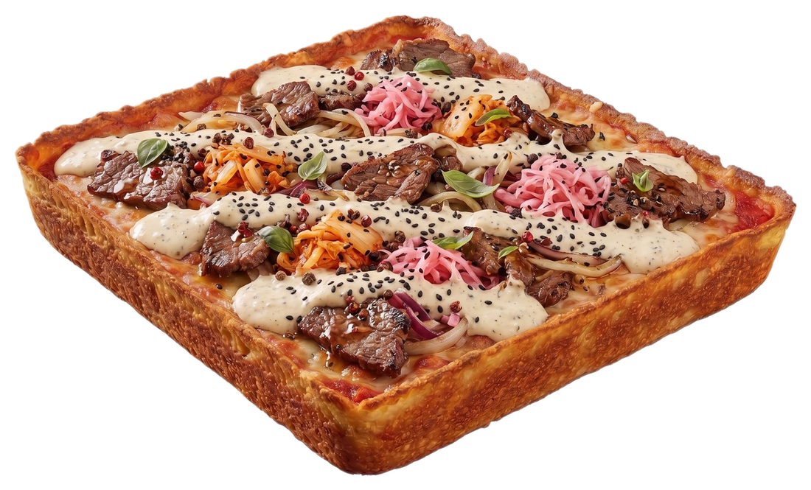

# MOTO PIZZA Berlin — Projektübergabe

**Stand:** 13.08.2026, ca. 20:35 Uhr · **Zweck:** Vollständiger Übergabestand, damit ein neuer Claude-Chat ohne Kenntnis der bisherigen Konversation nahtlos weiterarbeiten kann.

Diese Datei ist die **maßgebliche, aktuelle Quelle der Wahrheit**. `README.md` im Projektordner ist **veraltet** (beschreibt einen sehr frühen Stand) — ignorieren. Alle älteren `PROJECT-HANDOVER.md`-Versionen (z. B. vom 09.08.) sind durch diese Datei vollständig ersetzt.

Dies ist eine **lokale Demo-Website**, die **zusätzlich öffentlich auf GitHub Pages deployed** ist (`<meta name="robots" content="noindex, nofollow">` bleibt gesetzt, damit sie nicht in Suchmaschinen erscheint). Fiktive Detroit-Style-Pizzeria in Berlin. Kein Build-Step, kein Framework, reines HTML/CSS/Vanilla-JS. **Seit dieser Session hat das Projekt ein Git-Repository** (vorher nicht vorhanden).

### Projektpfad (kanonisch, alles wird hier direkt bearbeitet)
```
/Users/efeelbagli/Desktop/moto-pizza-demo/
```

### Öffentliche Live-URL
```
https://sincinityberlin.github.io/moto-pizza-demo/
```
- Plattform: **GitHub Pages**, Quelle: Branch `main`, Pfad `/` (root), öffentliches Repo
- GitHub-Repo: `https://github.com/sincinityberlin/moto-pizza-demo` (Account: `sincinityberlin`)
- Kein Login nötig, frei aufrufbar
- **Deployment-Workflow:** Änderungen lokal in `~/Desktop/moto-pizza-demo/` vornehmen → `git add -A && git commit -m "..." && git push origin main` → GitHub Pages baut automatisch neu (Build-Status prüfbar via `gh api repos/sincinityberlin/moto-pizza-demo/pages/builds/latest --jq .status`, dauert i. d. R. 15–30s bis `"built"`)
- Lokale Git-Identität (nur für dieses Repo, nicht global): `user.email demo@motopizza.local`, `user.name "MOTO PIZZA Demo"`

### Letzte Commits (neueste zuerst)
```
46616a6 Getraenke komplettiert (Red Bull Classic, 5x San Pellegrino Sorten, Sprudel/Still) + horizontales Swipe-Karussell fuer Getraenke/Desserts statt Grid
80e293a Original MOTO-Broschuere-Fonts (AdelleSansARA + Good Times) lokal eingebunden, ersetzt Google Fonts sitweit
f108133 Hero-Pizza auf Beef Lover umgestellt, Outline-Headlines (NICHT RUND/DUENN, BERLIN GEDACHT) vollflaechig gefuellt
ecfe76d Karussell: Frame-Seitenverhaeltnis an Pizza-Fotos angepasst (Landscape statt Quadrat/Portrait) + Kartenbreite erhoeht
b3814c4 Karussell: Pizzen deutlich groesser darstellen (Slide-Breite + Bildfuellung erhoeht)
4753494 Hero: markierte Zahnrad/Gauge-Icons durch Kolben/Tacho ersetzt, neue Hero-Pizza (MOTO)
4844d4a Hero: nur Motor-/Mechanik-Symbole, groesseres Logo, Slogan-Zeile 2 vollflaechig blau
04823a1 Mobile: Snacks/Getraenke als 2-Spalten-Grid statt Einzelspalte (mittlerweile durch Swipe-Karussell ersetzt, siehe oben)
2176728 Deploy: MOTO PIZZA Demo-Website (Initial-Commit, erstes GitHub-Pages-Deployment)
```
Arbeitsverzeichnis ist zum Zeitpunkt dieser Übergabe **sauber** (`git status` leer, alles committed und gepusht — lokal == live).

---

## 1. Aktueller Gesamtstatus

Die Seite ist vollständig gebaut und mehrfach live im Browser getestet (lokal per Scratchpad-Preview UND direkt auf der öffentlichen GitHub-Pages-URL, jeweils Desktop + Mobile). In dieser Session (Fortsetzung mehrerer vorheriger Sessions) wurden bearbeitet, in dieser Reihenfolge:
1. Öffentliches Deployment auf GitHub Pages eingerichtet (Repo neu erstellt, Pages aktiviert)
2. Snacks/Getränke: Mobile 2-Spalten-Grid statt 1-Spalte (später durch Swipe-Karussell abgelöst, siehe Punkt 8)
3. Hero: Gemüse-Toppings komplett durch weiße Motor-/Mechanik-Line-Art-Symbole ersetzt, Logo vergrößert, Slogan-Zeile 2 vollflächig blau
4. Hero: nutzergeprüfte Korrektur — Zahnrad-/Gauge-Icons (wirkten wie Sonne/Uhr, nicht eindeutig Motor-bezogen) durch Kolben/Tacho ersetzt; Hero-Pizza auf „MOTO“ gewechselt
5. Pizza-Karussell: Bilder deutlich vergrößert (Frame-Seitenverhältnis an tatsächliches Foto-Format angepasst)
6. Original-Markenfonts (AdelleSansARA + Good Times) eingebunden, Google Fonts entfernt, verbleibende Outline-Headlines vollflächig gefüllt, Hero-Pizza auf „Beef Lover“ gewechselt
7. Getränke-Sortiment komplettiert (7 neue, real recherchierte Produktfotos) + Getränke/Desserts als natives horizontales Swipe-Karussell umgebaut

**Nächster möglicher Arbeitsschritt** (vom Nutzer nicht explizit vorgegeben, nur offene Punkte, siehe Abschnitt 12).

### Dateistruktur
```
moto-pizza-demo/
├── index.html                522 Zeilen — alle Sections, data-section="..." markiert
├── css/style.css              ~1121 Zeilen — @font-face oben, dann :root Design-Tokens, dann ein Block pro Section
├── js/main.js                  512 Zeilen — eine Funktion pro Feature
├── data/menu.js                 201 Zeilen — MOTO_MENU (10 Pizzen), MOTO_SNACKS (2), MOTO_DRINKS (11), MOTO_INFO
├── serve.py                      Selbst-lokalisierender lokaler Static-Server, Port 8843 (im echten Projektordner; Scratchpad-Kopien nutzen z. T. 8845, siehe Abschnitt 11)
├── README.md                      ⚠️ VERALTET — nicht vertrauen
├── .claude/launch.json             Zeigt auf Scratchpad-Pfad der jeweils aktuellen Session (siehe Abschnitt 11) — muss pro neuer Session aktualisiert werden
├── .git/                            Git-Repo, Remote: github.com/sincinityberlin/moto-pizza-demo, Branch main
└── assets/
    ├── images/         Alle live genutzten Bilder — siehe Abschnitte 6–8 für vollständige Zuordnung
    ├── fonts/            AdelleSansARA (8 Gewichte) + Good Times + 2 arabische Fonts (siehe Abschnitt 5)
    ├── source/, crops/, grid/    Altes Rohmaterial aus der ursprünglichen Pizza-Freistellung, nicht mehr live referenziert, unkritisch, kann bleiben
```

---

## 2. Branding / Design-Tokens

Zentral in `css/style.css`, `:root`-Block.

### Markenfarben (unverändert seit Projektbeginn)
```css
--pink: #ec1e8d;        /* Hauptfarbe */
--pink-dim: #b8156c;
--blue: #16a3e6;         /* zweite Hauptfarbe */
--ink: #141116;          /* fast Schwarz — nur noch für Text/kleine UI-Elemente, KEINE großflächigen Hintergründe mehr */
--cream: #fbf4ec;        /* warmes Off-White — Seiten-Grundhintergrund (body) */
--cream-dim: #f0e6da;
--white: #ffffff;
```
Design-Richtung (aus einer früheren Session, weiterhin gültig): **Weiß = Hauptfläche, Pink = primärer Akzent, Blau = sekundärer Akzent, dunkle Farbe nur für Text.** Keine großflächigen dunklen Section-Hintergründe mehr (wurde in einer früheren Session bereits umgesetzt: `detroit`, `about`, `gallery`, `footer` sind weiß/cream-dim).

### Typografie — NEU in dieser Session: Original-Markenfonts statt Google Fonts
Die Original-Font-Dateien der MOTO-PIZZA-Broschüre wurden vom Nutzer bereitgestellt und lokal eingebunden. Google Fonts (`Archivo Black`, `Space Grotesk`, `Inter`) wurde **komplett entfernt** (kein `<link>` mehr im `<head>`, keine externe Anfrage mehr).

**Dateien in `assets/fonts/`:**
```
AdelleSansARA-Ultrathin.otf     AdelleSansARA-Light.otf      AdelleSansARA-Semibold.otf   AdelleSansARA-Heavy.otf
AdelleSansARA-Thin.otf          AdelleSansARA-Regular.otf    AdelleSansARA-Bold.otf       AdelleSansARA-Extrabold.otf
good-times-rg.otf               (Leerzeichen aus Original-Dateinamen "good times rg.otf" entfernt)
AraHamahAlislam-Regular.ttf     AraHamahAlFidaa-Regular.ttf  ⚠️ NICHT eingebunden — arabische Schriftfonts, keine
                                                                arabischsprachigen Inhalte auf der Seite vorhanden
```

**`@font-face`-Konfiguration** (ganz oben in `css/style.css`, vor dem `:root`-Block): Alle 8 AdelleSansARA-Schnitte werden unter **einem** CSS-`font-family`-Namen `"AdelleSansARA"` registriert, jeweils mit passendem `font-weight`, sodass der Browser automatisch anhand der im Stylesheet bereits vorhandenen `font-weight`-Werte (400/600/700 kommen im Sheet vor) die richtige Datei lädt:
```css
font-weight: 100 → AdelleSansARA-Ultrathin.otf
font-weight: 200 → AdelleSansARA-Thin.otf
font-weight: 300 → AdelleSansARA-Light.otf
font-weight: 400 → AdelleSansARA-Regular.otf
font-weight: 600 → AdelleSansARA-Semibold.otf
font-weight: 700 → AdelleSansARA-Bold.otf
font-weight: 800 → AdelleSansARA-Extrabold.otf
font-weight: 900 → AdelleSansARA-Heavy.otf
```
Zusätzlich ein **zweiter Alias** `"AdelleSansARA Display"` (eigener `@font-face`-Block, zeigt auf `AdelleSansARA-Heavy.otf`, aber mit `font-weight: 400` deklariert) — Trick, damit Headlines automatisch die fetteste Variante bekommen, ohne in jeder einzelnen Headline-Regel `font-weight: 900` ergänzen zu müssen. Und `"Good Times"` (eigene Familie, ein Schnitt, `font-weight: 400`).

**Font-Tokens** (`:root`):
```css
--font-display: "AdelleSansARA Display", "AdelleSansARA", sans-serif;   /* alle großen Headlines */
--font-head:    "AdelleSansARA", sans-serif;                             /* Nav, Buttons, Labels, Eyebrows */
--font-body:    "AdelleSansARA", sans-serif;                             /* Fließtext */
--font-ticker:  "Good Times", "AdelleSansARA Display", sans-serif;       /* NUR das Marquee-Laufband */
```
Da die **gesamte Website bereits vorher ausschließlich über diese drei Tokens** lief, greift der neue Font automatisch überall (Nav, Buttons, Snacks/Getränke-Karten, Footer, Pizza-Karussell-Panel etc.) — keine Einzelregeln mussten angepasst werden, außer dem Marquee (`.marquee__track`), das gezielt auf `--font-ticker` (Good Times) umgestellt wurde.

**Wichtig für Pfad-Debugging:** Die `@font-face src`-Pfade sind `../assets/fonts/...` (nicht `assets/fonts/...`) — relative Pfade in `style.css` lösen relativ zum `css/`-Ordner auf, nicht zur Projektwurzel. Das war ein Bug in dieser Session, bereits behoben.

### Layout-Tokens (unverändert)
```css
--container: 1240px;
--pad: clamp(20px, 5vw, 64px);
--ease: cubic-bezier(0.16, 1, 0.3, 1);
--ease-bam: cubic-bezier(0.34, 1.56, 0.64, 1);
--radius: 22px;
```

---

## 3. Hero-Section — aktueller Stand

### 3.1 Logo
- `assets/images/logo.png`, weiß via `filter: brightness(0) invert(1)`, oben mittig
- **Größe in dieser Session deutlich erhöht:** Desktop (≥900px) `height: 156px` (vorher 108px), margin-bottom 58px; Basis/Tablet `height: 100px` (vorher 72px), margin-bottom 44px; Mobile (<600px) `height: 76px` (vorher 52px), margin-bottom 30px. Seitenverhältnis über `width: auto` erhalten, keine Verzerrung.

### 3.2 Slogan
```html
<h1 class="hero__title">
  <span>CHEESE TO<br>THE EDGE.</span>                            <!-- WEISS, solide -->
  <span class="hero__title--outline">CRUNCH IN<br>EVERY BITE.</span>  <!-- BLAU, VOLLFLÄCHIG (Klassenname "--outline" historisch, KEIN Outline mehr!) -->
</h1>
```
`.hero__title--outline` wurde in dieser Session von `-webkit-text-stroke: 2px var(--blue); color: transparent;` (hohle Kontur) auf `color: var(--blue);` (voll ausgefüllt) geändert. Klassenname bewusst beibehalten (kein HTML-Rename), im CSS kommentiert.

### 3.3 Hero-Pizza — AKTUELL: „Beef Lover“
```html

```
**Verlauf in dieser Session:** ursprünglich `hero-pizza-full.png` (generisches Käse-Pizza-Asset) → zwischenzeitlich `pizza-moto.png` → **aktuell und final: `pizza-beeflover.png`** (Rind, Kimchi, eingelegter Kohl, Knoblauchsauce, schwarzer Sesam, rosa eingelegte Zwiebeln). Bild ist identisch mit dem Karussell-Bild der Pizza „Beef Lover“ (gleiche Datei, wiederverwendet). `object-fit: contain`, alle vier Ecken/kompletter Rand sichtbar, `max-height: 64vh` (Desktop) / `46vh` (Mobile-Basis).

### 3.4 Hero-Hintergrundsymbole — Motor-/Mechanik-Line-Art (in dieser Session komplett neu)
**Wichtiger Verlauf:** Ursprünglich 18–20 Cartoon-Gemüse-Symbole (Tomate, Karotte, etc.) → in dieser Session zunächst durch ein erstes Set aus Zahnrad/Kolben/Tacho/Lager/Pleuel/Turbo/Bremsscheibe/Gauge ersetzt → **Nutzer hat einen Screenshot mit Markierungen geschickt**: die Zahnrad-Icons (wirkten wie Sonnen) und die Gauge-/Uhr-Icons (wirkten wie Wecker) waren nicht eindeutig als Motorteile erkennbar → **finale Korrektur:** alle Zahnrad- und Gauge-Instanzen sowie eine zu klein wirkende Lager-Instanz wurden durch Kolben (piston) bzw. Tacho (speedo) ersetzt, exakt nach einem vom Nutzer mitgeschickten Referenzbild nachgebaut.

**Aktuelles finales Icon-Set** (definiert als `<symbol>`-artige `<g id="icon-...">`-Blöcke in einem unsichtbaren `<svg>` ganz oben in der `.hero`-Section, instanziiert per `<use href="#icon-...">`):
| Icon-ID | Motiv | Verwendet in Slots |
|---|---|---|
| `icon-piston` | Kolben mit Ringlinie + Pin-Bohrung, Pleuel-Stummel zu Wrist-Pin-Ring | `piston-1` bis `piston-7` (7×) |
| `icon-speedo` | Dome-Tacho, Punkte-Skala, Nadel, geteilte Grundlinie | `speedo-1` bis `speedo-5` (5×) |
| `icon-pleuel` | Pleuelstange (kleiner Ring oben, großer Ring unten, Schaft) | `pleuel-1`, `pleuel-2`, `pleuel-3` (3×) |
| `icon-turbo` | Turbolader/Turbinenrad, 4 fette Schaufeln + Mittel-Hub | `turbo-1`, `turbo-2` (2×) |
| `icon-brakedisc` | Bremsscheibe, 4 Bohrungen + Nabenkreuz | `brakedisc-1`, `brakedisc-2` (2×) |
| `icon-bearing` | Kugellager, 6 sichtbare Kugeln auf Ring | nur noch `bearing-2` (1×, hidden <600px) |

**Alle 20 Slot-Positionen, Größen, Delays, Mobile-Hide-Regeln** sind unverändert aus dem Gemüse-System übernommen (nur Icon + Klassenname getauscht) — inkl. der historisch wichtigen Position-Fixes (keine Icons in der Y-Range der Outline-Textzeile). CSS-Selektoren: `.hero__topping--<slot-name>` mit `top/left/right/bottom`-%-Werten, `width: clamp(...)`, `--rest-rot`. Tablet (<900px) hidden: `speedo-3`, `speedo-4`. Phone (<600px) hidden: `speedo-2`, `bearing-2`, `turbo-2`, `brakedisc-2`.

**Keine Sterne, Kreise, Diamanten, Kreuze mehr vorhanden** — vollständig entfernt.

### 3.5 Entrance-Animation (unverändert in der Technik, nur auf neue Icons übertragen)
CSS-`animation-delay`-Choreografie in `@media (prefers-reduced-motion: no-preference)`:
1. Logo (`heroLogoIn`, delay 0.05s)
2. Slogan zeilenweise (`heroLineIn`, delay 0.15s/0.26s)
3. Pizza (`heroPizzaIn`, delay 0.78s)
4. Alle 20 Motor-Icons gestaffelt (`heroToppingIn`/`heroToppingInLeft`/`heroToppingInRight`, delay 1.40s–2.16s in 0.04s-Schritten)
5. Buttons (`heroActionsIn`, delay 2.4s)

Funktioniert nachweislich weiterhin, mehrfach visuell verifiziert.

### 3.6 Scroll-/Parallax-Effekt (unverändert in der Technik)
`js/main.js`, Funktionen `initHeroParallax()` (Pizza, dezent) und `initHeroToppingsParallax()` (alle 20 Icons, `data-speed/-drift/-rotate/-tilt/-scale`-Attribute pro Element, `progress = clamp(scrollY / 560, -0.4, 2.4)`). Handoff-Mechanismus von CSS-Entrance zu JS-Parallax unverändert (kein Sprung). Funktioniert nachweislich weiterhin.

---

## 4. Navigation
Unverändert seit Projektbeginn: Desktop-Links (Menu / Detroit Style / Über uns / Standort) + „Jetzt bestellen“-Pill-Button ab 900px; darunter Burger-Menü mit Mobile-Fullscreen-Overlay. Kein Logo mehr im Nav-Header (bewusste frühere Design-Entscheidung). In dieser Session **nicht angefasst**, funktioniert nachweislich weiterhin.

---

## 5. Pizza-Karussell (10 Pizzen)

### 5.1 Bildzuordnung (final, aus einer früheren Session anhand der Zutaten-Beschreibungen in `data/menu.js` identifiziert, in dieser Session nicht verändert)
| id | Name | Bilddatei |
|---|---|---|
| moto | MOTO | `pizza-moto.png` |
| pepperoniking | Pepperoni King | `pizza-pepperoniking.png` |
| beeflover | Beef Lover | `pizza-beeflover.png` (auch als Hero-Pizza verwendet) |
| honeyinferno | Honey Inferno | `pizza-honeyinferno.png` |
| bighog | Big Hog | `pizza-bighog.png` |
| lemonshrimp | Lemon Shrimp | `pizza-lemonshrimp.png` |
| cremedepoulet | Crème de Poulet | `pizza-cremedepoulet.png` |
| root | Root | `pizza-root.png` |
| plant | Plant | `pizza-plant.png` |
| frico | Frico | `pizza-frico.png` |

Alle Bilder: freigestellt (transparent), Seitenverhältnis ~1100×665px (≈0,605 Höhe/Breite), alle vier Ecken + kompletter Rand sichtbar.

### 5.2 Karussell-Vergrößerung (NEU in dieser Session, wichtigste Karussell-Änderung)
**Problem:** Pizzen wirkten zu klein, viel Leerraum um sie herum, obwohl die Karten schon vorher einmal vergrößert worden waren.
**Ursache gefunden:** Das Karten-Frame hatte ein Seitenverhältnis von `1:1` (Mobile, quadratisch) bzw. `5:4` (Desktop, hochkant) — beides deutlich höher als die tatsächlich querformatigen Pizza-Fotos (≈0,605), wodurch bei `object-fit: contain` oben/unten viel Platz verschenkt wurde.
**Fix in `js/main.js`, Funktion `measure()`:**
```js
const ratio = 0.68;  // ersetzt: const isDesktop = ...; const ratio = isDesktop ? 5/4 : 1;
const slideHeight = slideWidth * ratio;
```
**Zusätzlich in `css/style.css`, `.selector`:**
```css
--slide-w: 92%;                                    /* Basis/Mobile, vorher 66% */
@media (min-width: 700px)  { --slide-w: 78%; }      /* vorher 56% */
@media (min-width: 1000px) { --slide-w: 58%; }      /* vorher 40% */
```
Und `.selector__frame img { max-width: 92%; max-height: 92%; }` (vorher 76%). Ergebnis: Pizza ist jetzt der klare visuelle Mittelpunkt, füllt das Karten-Frame fast randlos, bleibt aber durch `object-fit: contain` garantiert immer vollständig sichtbar (keine Beschneidung möglich). Visuell auf Mobile (375px) und Desktop (1400px) bestätigt.

### 5.3 Swipe-/Drag-/Touch-Mechanik (in dieser Session NICHT verändert)
`initPizzaSelector()` in `js/main.js` — Momentum, Snap, Infinite Loop (Klon-Slides), Pfeiltasten, Tastatur-Navigation, `01/10`-Anzeige. Funktioniert nachweislich weiterhin (Settle-Animation dauert ca. 300–700ms nach Klick/Swipe — bei Tests beachten, Screenshot ggf. erst danach aussagekräftig).

---

## 6. Snacks
`data/menu.js`, `MOTO_SNACKS`, id-Format matcht `assets/images/snack-<id>.png`:
| id | Name | Beschreibung | Preis |
|---|---|---|---|
| lavacake | Chocolate Lavacake | „Mit flüssigem Kern und echter belgischer Schokolade.“ | 2,99 € |
| cheesecake | New York Cheesecake | „Rundes Törtchen aus Frischkäsecreme auf zerkrümeltem Kuchenboden.“ | 2,99 € |

Namen/Beschreibungen/Preise in dieser Session an die vom Nutzer mitgeschickte Speisekarte angeglichen (vorher andere Beschreibungen, andere Preise 6,50€/6,00€). Bilder bereits vorher vorhanden und unverändert: `snack-lavacake.png`, `snack-cheesecake.png`.

---

## 7. Getränke (11 von 12 laut Speisekarte — 1 nicht auffindbar, siehe unten)

`data/menu.js`, `MOTO_DRINKS`, id-Format matcht `assets/images/drink-<id>.png`. **In dieser Session von 4 auf 11 Einträge erweitert.**

| id | Name / Tag | Bilddatei | Status |
|---|---|---|---|
| redbull-classic | Red Bull — Classic/Original | `drink-redbull-classic.png` | **NEU** dieser Session |
| redbull-juneberry | Red Bull — Juneberry | `drink-redbull-juneberry.png` | bereits vorhanden |
| redbull-whitepeach | Red Bull — White Peach | `drink-redbull-whitepeach.png` | bereits vorhanden |
| aranciata | San Pellegrino — Aranciata | `drink-aranciata.png` | **NEU** dieser Session |
| limonata | San Pellegrino — Limonata | `drink-limonata.png` | bereits vorhanden |
| aranciata-rossa | San Pellegrino — Aranciata Rossa | `drink-aranciata-rossa.png` | **NEU** dieser Session |
| pompelmo | San Pellegrino — Pompelmo | `drink-pompelmo.png` | **NEU** dieser Session |
| limone-menta | San Pellegrino — Limone & Menta | `drink-limone-menta.png` | **NEU** dieser Session |
| limonata-lila | San Pellegrino — Melograno & Arancia | `drink-limonata-lila.png` | bereits vorhanden (Dateiname historisch, Inhalt korrekt) |
| sprudel | S.Pellegrino — Sprudel | `drink-sprudel.png` | **NEU** dieser Session (S.Pellegrino-Mineralwasserflasche) |
| still | Acqua Panna — Still | `drink-still.png` | **NEU** dieser Session, ⚠️ siehe Hinweis unten |

Alle Preise: 5,00 € (an Speisekarte angeglichen, vorher 3,50 €).

**⚠️ Zwei wichtige Hinweise für die Weiterarbeit:**
1. **„San Pellegrino Kirsche & Zitrone“ fehlt.** Ausgiebig recherchiert (Google Bildersuche war durch CAPTCHA blockiert, daher über mehrere Fachhändler-Shops gesucht) — dieses Produkt existiert unter diesem Namen nicht im aktuellen San-Pellegrino-Sortiment. Es wurde **bewusst kein falsches/generisches Bild verwendet**. Falls der Nutzer ein Referenzfoto liefert, muss es noch ergänzt werden (12. Getränk).
2. **„Still“ = Acqua Panna, nicht San Pellegrino.** San Pellegrino stellt selbst kein stilles Wasser her (nur Sparkling). Acqua Panna ist das reale still-Wasser-Pendant aus derselben Nestlé-Markenfamilie, das in der Gastronomie standardmäßig neben S.Pellegrino serviert wird — als nächstliegende reale Lösung verwendet, nicht 1:1 „San Pellegrino“-gebranded.

**Bildquellen (alle reale Herstellerfotos, KEINE KI-Generierung, siehe Projektregel):** über direkte Produktseiten bei Fachhändlern gefunden (unter anderem boxncase.com, missionliquor.com, specialtypantry.com, aqua-amore.com, newyorkbeverage.com), jeweils per `curl` heruntergeladen und lokal mit dem PIL-Freistellungsskript (Border-Flood-Fill, siehe unten) transparent freigestellt.

### 7.1 Freistellungs-Workflow (Skript existiert nur im Scratchpad, nicht im Projekt)
`cutout.py` (Python/PIL + scipy) — Border-Flood-Fill-Ansatz: Pixel werden nur dann als „Hintergrund“ entfernt, wenn sie hell/farbarm sind **und** über eine zusammenhängende Fläche mit dem Bildrand verbunden sind (verhindert, dass helle Produktdetails wie weiße Saucen fälschlich mit-entfernt werden). Bei Bedarf im nächsten Chat neu schreiben (Session-Scratchpad ist danach nicht mehr verfügbar) — Kernlogik: `scipy.ndimage.label` auf eine „hell + farbarm“-Maske, nur die Komponenten behalten, die den Bildrand berühren, dann `alpha=0` setzen + leichter Gaussian-Blur auf den Alpha-Kanal für weiche Kanten.

---

## 8. Getränke/Desserts-Layout — Horizontales Swipe-Karussell (NEU in dieser Session, größte strukturelle Änderung dieser Session)

**Vorher:** CSS-Grid, auf Mobile 2 Spalten nebeneinander mit Zeilenumbruch nach unten.
**Jetzt:** Natives horizontales Scroll-Snap-Karussell, **eine einzige Reihe**, kein Umbruch — sowohl auf Mobile als auch auf Desktop identisch umgesetzt. **Kein JavaScript nötig** — Touch-Swipe, Drag, Momentum und Snap werden komplett vom Browser nativ übernommen.

**CSS (`css/style.css`, Abschnitt „SNACKS / GETRÄNKE“):**
```css
.product-grid {
  display: flex;
  gap: 16px;
  overflow-x: auto;
  scroll-snap-type: x mandatory;
  -webkit-overflow-scrolling: touch;
  scrollbar-width: none;              /* Scrollbar visuell versteckt */
}
.product-grid::-webkit-scrollbar { display: none; }

.product-card {
  scroll-snap-align: start;
  flex: 0 0 auto;
  width: 260px;                        /* Snacks-Karten, Desktop/Basis */
}
.product-grid--drinks .product-card { width: 172px; }  /* Getränke-Karten, Desktop/Basis */

@media (max-width: 640px) {
  .product-card { width: 68vw; max-width: 260px; }      /* Snacks, Mobile — vw-basiert für Edge-Peek */
  .product-grid--drinks .product-card { width: 40vw; max-width: 165px; }  /* Getränke, Mobile */
}
```
Die `vw`-basierte Kartenbreite auf Mobile sorgt dafür, dass unabhängig von der genauen Displaybreite (375/390/393/430px etc.) immer ein kleiner Teil der nächsten Karte am rechten Rand sichtbar bleibt (verifiziert: ~11px Peek bei 375px Breite). JS-Renderfunktion `renderProductGrid()` in `js/main.js` (rendert `MOTO_SNACKS`/`MOTO_DRINKS` in `#snacksGrid`/`#drinksGrid`) wurde **nicht verändert** — nur CSS.

Getestet: Mobile (375px, scrollLeft-Snap verifiziert per JS: `grid.scrollLeft` rastet exakt auf Kartenbreite+Gap ein), Desktop (1400px, zeigt 6 Getränke gleichzeitig, 7. peekt am Rand).

---

## 9. Sonstige Pizza-Bild-Referenzen sitweit (aus früherer Session, in dieser Session nicht verändert)
- Detroit-Style-Feature-Cards (`index.html`, Section `detroit`): `pizza-moto.png`, `pizza-frico.png`, `pizza-bighog.png`, `pizza-honeyinferno.png`, alle `object-fit: contain`
- Gallery-Streifen (`renderGallery()` in `js/main.js`): alle 10 Pizzen, `object-fit: contain`
- Alle dunklen Sections (`detroit`, `about`, `gallery`, `footer`) sind bereits seit einer früheren Session weiß/cream-dim, Footer-Logo ohne Invert-Filter (zeigt Originalfarbe)

---

## 10. Lokale Vorschau starten

**Direkt im echten Projektordner (einfachster Weg):**
```bash
cd ~/Desktop/moto-pizza-demo
python3 -m http.server 8843
```
Dann `http://localhost:8843`.

**Für Claudes `preview_start`-Tool (Browser-Pane) — Sandbox hat keinen Zugriff auf `~/Desktop`:**
1. Eigenes Scratchpad-Verzeichnis der neuen Session ermitteln
2. `rsync -a --exclude '.git' --exclude 'serve.py' ~/Desktop/moto-pizza-demo/ <scratchpad>/moto-pizza-demo/`
3. In `<scratchpad>/moto-pizza-demo/serve.py` den `PORT` auf einen freien Port setzen (in dieser Session wurde **8845** verwendet, da 8843 von einer parallel laufenden anderen Session belegt war — vor Wiederverwendung prüfen)
4. Vault-`.claude/launch.json` (`/Users/efeelbagli/Library/Mobile Documents/iCloud~md~obsidian/Documents/second-brain/second-brain/.claude/launch.json`) `runtimeArgs` auf `<scratchpad>/moto-pizza-demo/serve.py` und `port` auf denselben Port anpassen
5. `preview_start` mit `name: "moto-pizza-demo"`
6. **Nach jeder Code-Änderung erneut rsync**, sonst arbeitet die Preview auf altem Stand

**Bekannte Tool-Eigenheiten dieser Browser-Pane-Umgebung** (kein Website-Bug, rein Test-Tool-Verhalten):
- Aggressives HTML-Caching trotz Server-Neustart → mit `?v=<beliebiger-wert>` an der URL cache-busten, oder frischen Tab öffnen
- Nach `resize_window` **plus** `navigate` auf demselben Tab kann der Screenshot „in eine kleine Box gequetscht“ wirken → Workaround: frischen Tab öffnen, **entweder** resizen **oder** navigieren, nicht beides auf demselben Tab kombiniert, dann erst screenshotten
- Gelegentlich reine Rendering-Aussetzer (Screenshot zeigt leere Fläche, obwohl DOM/CSS per JS-Check nachweislich korrekt sind) → per `getComputedStyle`/`getBoundingClientRect` direkt verifizieren statt nur Screenshot zu vertrauen

**Live-Deployment-Check (bevorzugt, da ohne Sandbox-Einschränkungen):**
```
preview_start mit url: "https://sincinityberlin.github.io/moto-pizza-demo/"
```

---

## 11. Erfolgreich getestete Funktionen (Stand dieser Übergabe)
✅ Hero: Entrance-Animation, Scroll-Parallax (20 Motor-Icons + Pizza), Logo-Größe, Slogan-Farben, Hero-Pizza vollständig sichtbar
✅ Nur Motor-/Mechanik-Icons im Hero (Kolben, Tacho, Pleuel, Turbo, Bremsscheibe, 1× Lager), keine Sterne/Kreise/Gemüse mehr
✅ Navigation Desktop + Mobile-Burger-Menü
✅ Pizza-Karussell: alle 10 Pizzen, deutlich vergrößert, vollständig sichtbar, Pfeile, Settle-Animation, `01/10`-Anzeige korrekt
✅ Snacks- und Getränke-Swipe-Karussell: Snap-Verhalten per JS verifiziert, Desktop Mehrfach-Ansicht, Mobile Edge-Peek
✅ Alle 11 Getränke- und 2 Snack-Bilder laden korrekt (200 OK, auch live)
✅ Original-Fonts laden korrekt (200 OK lokal + live, `document.fonts` Status „loaded“ für alle tatsächlich genutzten Gewichte)
✅ Vollflächige Farbfüllung bei „NICHT RUND.“, „NICHT DÜNN.“, „BERLIN GEDACHT.“, „CRUNCH IN EVERY BITE.“ (alle vorher hohle Outline-Schrift)
✅ Keine Konsolenfehler (mehrfach per `read_console_messages` geprüft, lokal und live)
✅ Live-URL identisch zum lokalen Stand (mehrfach per DOM-Check auf `sincinityberlin.github.io` verifiziert)
✅ Getestete Breiten: 375px (Mobile), 1400px (Desktop) — **390/393/430px wurden in dieser Session nicht erneut einzeln getestet** (waren aber in einer früheren Session für das vorherige Grid-Layout bereits geprüft; das neue Swipe-Karussell nutzt `vw`-Einheiten und sollte sich sauber skalieren, aber noch nicht explizit auf diesen Zwischenbreiten bestätigt)

---

## 12. Offene Punkte / mögliche nächste Schritte

1. **„San Pellegrino Kirsche & Zitrone“** — 12. Getränk laut Speisekarte, real nicht auffindbar. Warten auf Nutzer-Referenzbild oder Entscheidung, ob weggelassen werden soll (aktuell: weggelassen, 11/12 Getränke vorhanden).
2. **Tablet-/Zwischenbreiten (390/393/430px)** für das neue Swipe-Karussell noch nicht explizit re-getestet (siehe Abschnitt 11).
3. Keine weiteren vom Nutzer offen kommunizierten Aufgaben zum Zeitpunkt dieser Übergabe.

---

## 13. Sonstiges / Technische Rahmenbedingungen (unverändert)
- `<meta name="robots" content="noindex, nofollow">` weiterhin gesetzt (bewusst, Demo soll nicht in Suchmaschinen erscheinen — Website ist aber öffentlich per Direktlink erreichbar)
- Alle Produktbilder ausschließlich reale Fotos (Nutzer-Uploads oder recherchierte Herstellerfotos), **nie KI-generiert** — harte Projektregel, gilt weiterhin uneingeschränkt, auch für die 7 in dieser Session neu beschafften Getränkebilder
- Bei Unsicherheit über den „richtigen" aktuellen Stand: **diese Datei sticht** README.md und alte Notizen

---

## Kurz-Zusammenfassung für den allerersten Blick

Fertige, **öffentlich unter https://sincinityberlin.github.io/moto-pizza-demo/ live deployte** Detroit-Style-Pizza-Demo-Website „MOTO PIZZA Berlin". In dieser Session: GitHub-Pages-Deployment eingerichtet; Hero-Deko komplett auf eindeutige Motor-/Mechanik-Line-Art (Kolben/Tacho/Pleuel/Turbo/Bremsscheibe/Lager) umgestellt, nutzergeprüft und korrigiert; Hero-Pizza jetzt „Beef Lover"; Original-Markenfonts AdelleSansARA (8 Gewichte) + Good Times lokal eingebunden, Google Fonts entfernt; alle verbliebenen Outline-Headlines vollflächig gefüllt; Pizza-Karussell durch Seitenverhältnis-Fix deutlich vergrößert; Getränke-Sortiment von 4 auf 11 (von 12 laut Speisekarte) Positionen erweitert mit real recherchierten Herstellerfotos; Getränke/Desserts von Grid auf natives horizontales Swipe-Karussell umgebaut. Alles committed, gepusht, live verifiziert, Arbeitsverzeichnis sauber.
